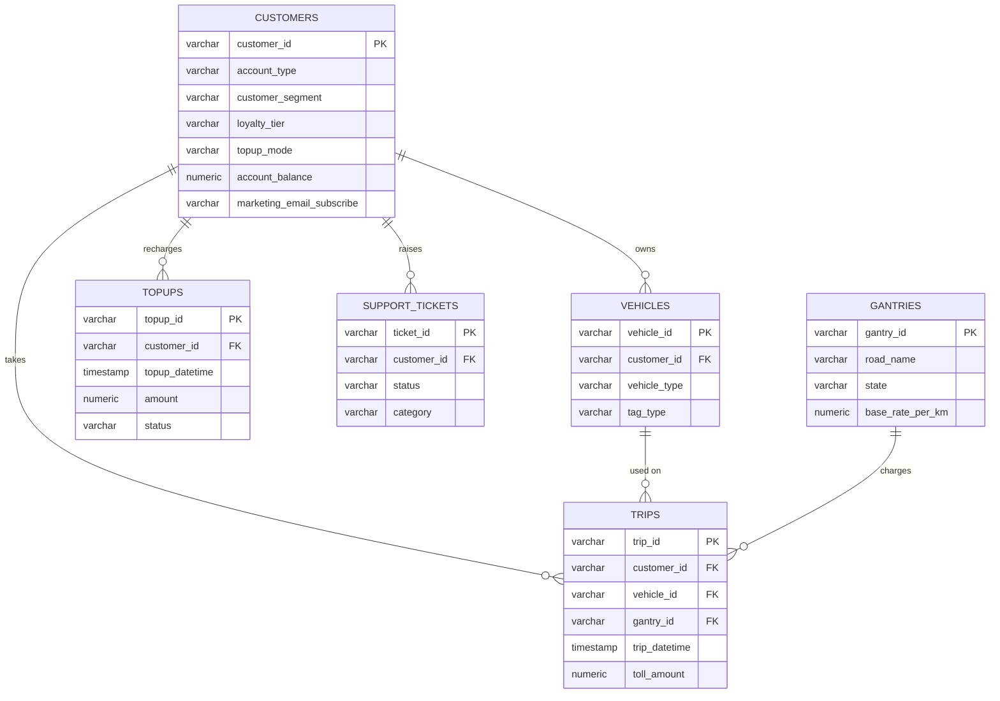
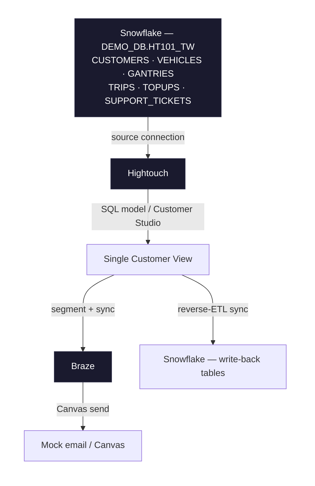
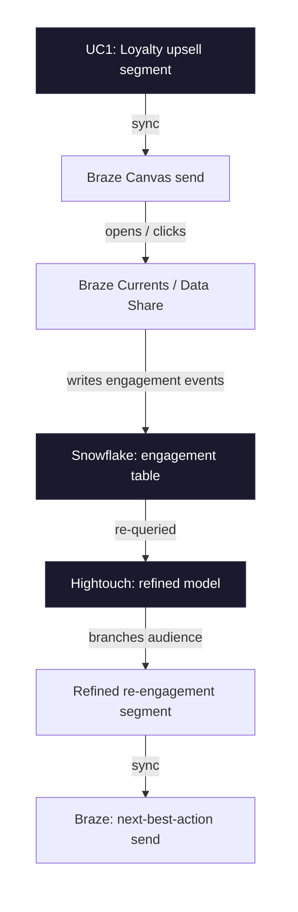

# Relationships — TollWay

## Entity relationship diagram

`CUSTOMERS` is the identity spine. Every other table hangs off `customer_id`. `TRIPS` is the
only table with two FKs beyond `customer_id` (`vehicle_id`, `gantry_id`) — it's the busiest join
in the dataset and the one Module 2's single customer view has to handle.

## Architecture — sources to destinations (current, v1)

(Split into two shorter rows of ~3 nodes each — the six tables are also listed inside a single
Snowflake box rather than as six separate nodes — same information, far less horizontal width
either way, which matters for legibility once this renders large. A single 6-node horizontal row
was still too wide to stay legible even after that first consolidation.)

Module 1 builds the Snowflake→Hightouch connection and the first raw SQL model. Module 2 builds
the single customer view. Module 3 adds the Braze and Snowflake reverse-ETL destinations.
Module 4 builds the segment/sync/send. BigQuery is not part of this diagram for v1 — see
`inconsistencies.md`.

## Closing the loop (Module 5 — the payload the whole course builds toward)

(Split into two shorter rows of 3 nodes each, connected top-to-bottom, instead of one long
6-node horizontal chain — the single-row version was too wide to stay legible once rendered
large.)

This is the single diagram that ties Modules 1–5 together: the loyalty segment built in Module 4
(UC1) sends a campaign, Braze's own engagement data flows back into the same Snowflake schema
the colleague built in Module 1, and Hightouch re-queries it to build a segment that's smarter
than anything available on day one. This table doesn't exist yet — it gets built when Module 5's
lesson content is written.
