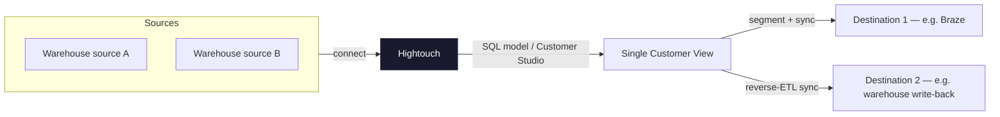

# Architecture Overview (generic)

This is the shape every business pack instantiates with real table/object names — see the
pack's `dictionary/relationships.md` for the concrete version (e.g. TollWay's uses one Snowflake
source, no Source B, since BigQuery is out of scope for v1).
