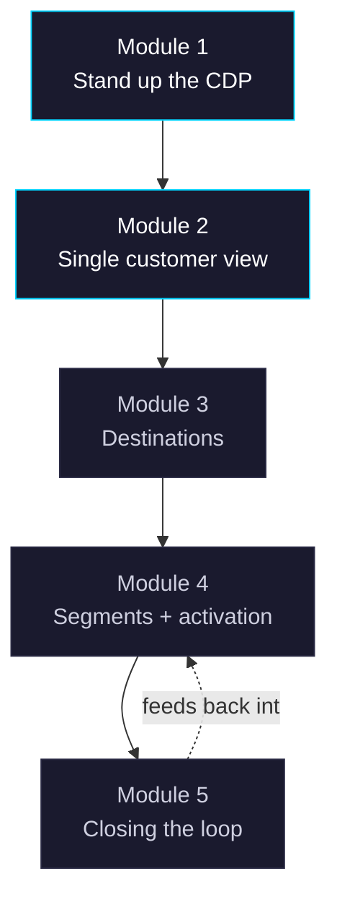

# Course Flow (generic)

Cyan-bordered modules are today's deep dive; grey-bordered modules are roadmap-only for now.
This coloring is a template — update per lesson as later modules move from roadmap to deep dive.
